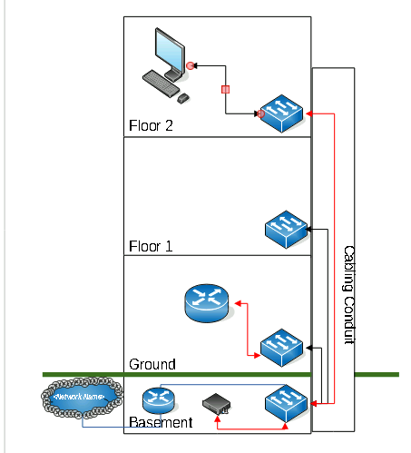

# Network+ Topology Practice
Created this repository to show examples of network topologies I've created during my studies for the Network+ exam. 

## Physical Network 

` red cable = fiber optic &
black cable = copper `

